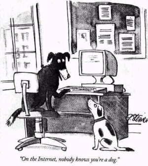

Title: 关于站长
Date: 1987-02-11
Modified: 2023-10-20
Slug: about
Authors: Kaffa
Summary: 关于站长
Image: /img/2023/about-kaffa.png

## 必要的开场

不会吧！不会吧！你不会真的来了吧？

我非常激动，你终于找到叻我的个人网站！

Hello，我是 Kaffa.im 的站长，网名 Kaffa（观察者A：好像重复了；观察者B：嗯，不符合 DRY 原则）。诚如所见，我(们)来自中国，很高兴认识你。

也许你听过 Kaffa 这个词，或者恰好你来自 Ethiopia 的 Kaffa Province。2018 年我选择这个网名是因为我是一个第三波咖啡爱好者，而传说咖啡是在 Kaffa 森林中发现的。

最初，它的意义是 Keep Agile & Free，此时我赋予了它[新的意义](\content\2023\20231017-关于网站2.0想法.md)。

## 个人网站

作为中国 PC 时代的幸存者，当然也是个中文互联网早期拥有个人主页的站长，曾在网易 126 和 ChinaRen 提供个人主页服务时做过个人网页，这些内容和构建现代化的前端工程来说，也不值一提。

经过了 Web 2.0 博客时代和移动互联网时代，中文优质内容逐渐进入私域和平台化了，人们都明白了注意力是一种有限的资源，它们小于等于所有人的自主时间（含摸鱼时间）的总和，愿意使用独立域名来持续发布内容的人越来越少。

本站选择使用独立域名，它更吻合本站主旨，符合独立思维表达，另一方面，也看到独立也是一种相对的东西，我们从原始的生物状态中脱离出来获得独立，在获得力量感的同时，也割裂了与他人的连接，这两者总是矛盾的。

因此，我也常连接在该技术领域的专家，比如 Jeremy Thomas, Justin Mayer，在我的工作中，也常惠于这些乐于分享的人。我在领域中没有专家的技术深度，但借助各领域乐于分享的专家分享的事物，也创造过好几个版本的个人网站。我不是牛人，也不是高手，只是站在了这些分享的肩膀上。

在今天这个最好的时代和最坏的时代，在这个认知盈余的时代，我希望利用我的自由时间，进行更多的创造性行为，而这些的中心就是 Kaffa.im ，我用它来集散我的在线生活。

## 身份与真名

> "On the Internet, nobody knows you're a dog." —— Peter Steiner

Peter Steiner 是个漫画家，一生中也写过不少小说，在历史留痕的还是人创造的东西。身份只是人虚构的面具，一位姓钱的大师曾说过：“爱她，就读她的代码。当你吃了一颗鸡蛋，也不用想着去看看下蛋的鸡。”因此，这里暂没有显示身份和真名，期望与你通过互动，并相互认识。

更多时候，我们无法像张爱玲一样，写出《半身缘》、又写出《小团圆》；无法像 RMS 拿出 Emacs 又拿出 GCC；无法像 Linus Torvalds 创造 Linux，又创造 Git；也不能像姚中仁，拿出《九局下半》，又拿出《脏艺术家》，但我们可以一名差不多的软件工程师一样，Show what I created, show the code to the world, that's enough，就足够!

## 记录对世界的探索

基于人的 ego 对自我的片面认识，我更认同人在人生中更似[《随机漫步的傻瓜》]()，我很幸运在我人生中经历了较完整的康德拉季耶夫长波周期，也很幸运我的专业让我有独立建站的能力。所以，“傻瓜”站在命运中的风口上了，我将在此记录下我对“风”的探索和乐趣，与汝共享。
